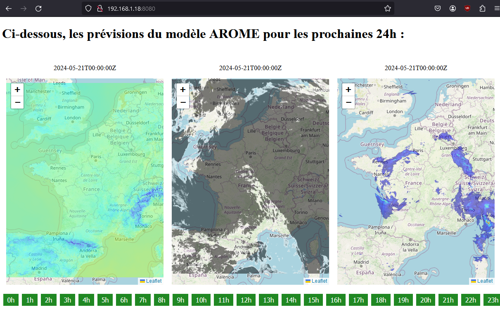

# weather_data_visualization : Weather map generator for short-term forecasting

The aim of this repository is to provide a Python API for generating maps using data from [Météo France's weather models](https://portail-api.meteofrance.fr/).
Weather maps, such as rainfall, temperature, etc., are generated directly from raw data calculated by weather models (currently Météo France's AROME model).
Generating maps from raw data will subsequently allow a wide range of possibilities for the extracted data. For example, we could output numerical forecasts for specific parameters by city, or averaged over a specific region.

The project is divided into 3 parts:
- the [**core**](core/) part, which corresponds to the Python API for data processing. This part downloads the data from Météo France, then extract raw datas into Numpy arrays using the [ecCodes library](https://github.com/ecmwf/eccodes) and finally generate from them colormaps overlays (PNG images)

- the [**website**](website/) section, which contains a draft web page to display 3 forecast maps: rain, temperature and clouds. The data overlays generated by the core part are retrieved and added on top of an OpenStreetMap interractive map displayed using [Leaflet](https://github.com/Leaflet/Leaflet)

- the [**docker**](docker/) part, which builds a docker image containing the core and website parts, and integrates an httpd server to display the website.

The project is divided into two parts:

- download_data, which allows you to download data from the AROME model of Météo France. Depending on the date and time of launch, the most recent run is selected to obtain the most accurate data possible at time t

- process_data which uses the downloaded data to generate maps with the data on an open street map background, for the next 24 hours

<br>

## Installing and using the docker image

This project contains everything you need to build a docker image containing everything you need to set up the project, and get the weather maps generated on a web server.

This first approach makes it very easy to use the project.

The Docker image must be built from the repository root, by specifying the Dockerfile present in the docker folder:
```console
cd [this repository]
docker build -t [IMAGE NAME] -f docker/Dockerfile .
```

Once built, the docker image can be launched in deamon mode:
```console
docker run --rm -dit -p [DESIRED PORT]:80 [IMAGE NAME]
```

When the container is launched, the [init.sh](docker/init.sh) script is run. It downloads the first weather data from Meteo France and generates the first overlays. Once this is complete, the httpd server is launched. Then cron jobs will update the maps every hour.

Once the container is running, the weather map website can be accessed on port [DESIRED PORT] (here 8080 for example):

 

<br>

## Using the Python API directly

### API requierments

The API requires Python 3.X with the following libraries:

- eccodes
- numpy
- matplotlib
- requests

The eccodes Python library is just a wrapper, and then need the libeccodes-dev package to be installed (with apt for example). Furthermore, the API also uses [GDAL](https://github.com/OSGeo/gdal) to remap overlays from one projection to another using gdal-warp.

The requierments can be installed on Ubuntu with the following commands:

```console
sudo apt update
sudo apt install python3 python3-pip libeccodes-dev cron vim gdal-bin
sudo apt clean

pip3 install --break-system-packages eccodes numpy matplotlib requests
pip3 cache purge
```

<br>

## API usage

The various API files are located in the [core/](core/) folder.
Before using the various Python scripts, you need to create a **user_settings.json** file in the [core](core/) folder. Inside this file, you need to add an object **api_keys**, with inside a data pair holding a valid AROME API key **"arome": "YOUR_API_KEY"**:
```JSON
{
    "api_keys": {
        "arome": "YOUR_API_KEY"
    }
}
```

An API key for the Arome model can be obtained from the official Météo France API site: https://portail-api.meteofrance.fr/

Once done, the two following Python scripts can then be used:

- **download_arome_data.py**

This script downloads the raw data from the Arome model as GRIB2 files for the 34 hours from the last available Arome run. From this raw data, it will then be possible to calculate forecasts for the next 24 hours, starting from the current time.

        python3 download_arome_data.py [-h] [-d {rain,temp,clouds} [{rain,temp,clouds} ...]]

        options:
        -h, --help            show this help message and exit
        -d {rain,temp,clouds} [{rain,temp,clouds} ...], --data_types {rain,temp,clouds} [{rain,temp,clouds} ...]
                                Metrics wanted (default: ['rain', 'temp', 'clouds'])

        example :
        python3 download_arome_data.py -d temp

- **arome_data_to_image.py**

This script converts raw data from the Arome model into a colormap adapted to the type of data selected. These colormaps, which are simply PNG images, can then be superimposed on an OSM map, for example, to visualize the data spatially (e.g. where it's raining at what time).

Within the script, model data is first extracted from GRIB files and stored in Numpy arrays. It is then possible to imagine any kind of processing or information extraction on these arrays, using Python's processing capabilities.

        python3 arome_data_to_image.py [-h] [--mlat MLAT] [--Mlat MLAT] [--mlon MLON] [--Mlon MLON] [-p PROJECTION] [-d {rain,temp,clouds} [{rain,temp,clouds} ...]]

        options:
        -h, --help            show this help message and exit
        --mlat MLAT           Minimum latitude (in deg) (default: None)
        --Mlat MLAT           Maximum latitude (in deg) (default: None)
        --mlon MLON           Minimum longitude (in deg) (default: None)
        --Mlon MLON           Maximum longitude (in deg) (default: None)
        -p PROJECTION, --projection PROJECTION
                                Projection code (default: EPSG:4326)
        -d {rain,temp,clouds} [{rain,temp,clouds} ...], --data_types {rain,temp,clouds} [{rain,temp,clouds} ...]
                                Metrics wanted (default: ['rain', 'temp', 'clouds'])

        example :
        python3 arome_data_to_image.py --mlat 40 --Mlat 54 --mlon -8 --Mlon 12 -p EPSG:3857 -d temp
